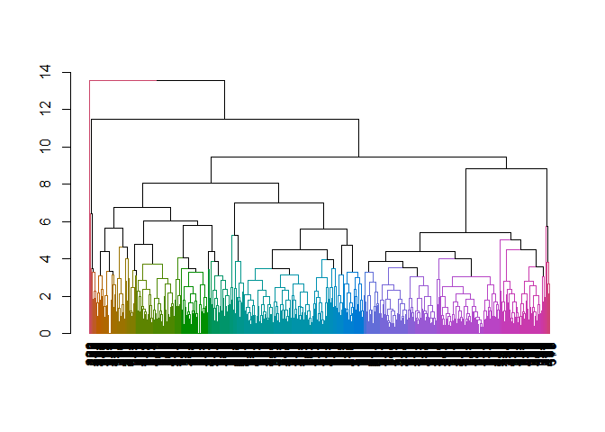

Hierarchical Clustering
================

For this example, the `pokemon` dataset is used

``` r
suppressPackageStartupMessages(library(dplyr))
set.seed(1000)

pokemon <- read.csv('pokemon.csv')

# subset features
df <- pokemon %>% select(HP, Attack, Defense, Sp.Atk = Sp..Atk, Sp.Def = Sp..Def, Speed)
head(df)
```

    ##   HP Attack Defense Sp.Atk Sp.Def Speed
    ## 1 45     49      49     65     65    45
    ## 2 60     62      63     80     80    60
    ## 3 80     82      83    100    100    80
    ## 4 80    100     123    122    120    80
    ## 5 39     52      43     60     50    65
    ## 6 58     64      58     80     65    80

Now the data is subsetted into a matrix, we can scale the data and run
hierarchical clustering on it

``` r
df.scaled <- scale(df)
hclust.model <- hclust(dist(df.scaled))
```

And view a dendrogram of it with the height limited to 3

``` r
suppressPackageStartupMessages(library(dendextend))

dgram <- as.dendrogram(hclust.model)
dgram2 <- color_branches(dgram, h = 3)
plot(dgram2)
```

<!-- -->
