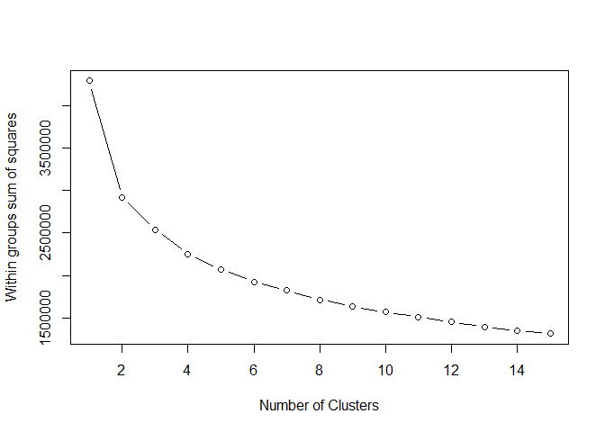
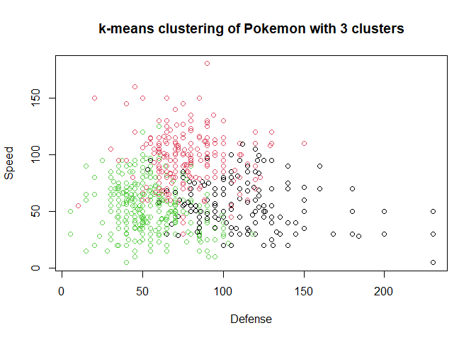

k-means clustering
================

First we’ll run k-means clustering on the `pokemon` dataset from
[Kaggle](https://www.kaggle.com/datasets/abcsds/pokemon?resource=download).

The number of clusters is not known beforehand, so testing different
`center` parameters may be a good idea.

``` r
library(dplyr)
```

    ## 
    ## Attaching package: 'dplyr'

    ## The following objects are masked from 'package:stats':
    ## 
    ##     filter, lag

    ## The following objects are masked from 'package:base':
    ## 
    ##     intersect, setdiff, setequal, union

``` r
pokemon <- read.csv('pokemon.csv')

# subset features
df <- pokemon %>% select(HP, Attack, Defense, Sp..Atk, Sp..Def, Speed)

# Initialize total within sum of squares error: wss
wss <- 0

# Look over 1 to 15 possible clusters
for (i in 1:15) {
  # Fit the model: km.out
  km.out <- kmeans(df, centers = i, nstart = 20, iter.max = 50)
  # Save the within cluster sum of squares
  wss[i] <- km.out$tot.withinss
}
```

Now we create a scree plot of these kmeans clusters to determine the
best number of centers

``` r
# Produce a scree plot
plot(1:15, wss, type = "b", 
     xlab = "Number of Clusters", 
     ylab = "Within groups sum of squares")
```

<!-- -->

We can choose 3 as the number of clusters

``` r
# Build model with k clusters: km.out
km.out <- kmeans(df, centers = 3, nstart = 20, iter.max = 50)

# View the resulting model
km.out
```

    ## K-means clustering with 3 clusters of sizes 175, 270, 355
    ## 
    ## Cluster means:
    ##         HP   Attack   Defense   Sp..Atk  Sp..Def    Speed
    ## 1 79.30857 97.29714 108.93143  66.71429 87.04571 57.29143
    ## 2 81.90370 96.15926  77.65556 104.12222 86.87778 94.71111
    ## 3 54.68732 56.93239  53.64507  52.02254 53.04789 53.58873
    ## 
    ## Clustering vector:
    ##   [1] 3 3 2 2 3 3 2 2 2 3 3 1 2 3 3 3 3 3 3 2 3 3 2 2 3 3 3 2 3 2 3 2 3 1 3 3 1
    ##  [38] 3 3 2 3 2 3 2 3 3 3 2 3 3 2 3 1 3 2 3 3 3 2 3 2 3 2 3 2 3 3 1 3 2 2 2 3 1
    ##  [75] 1 3 3 2 3 2 3 1 1 3 2 3 1 1 3 2 3 3 2 3 1 3 1 3 1 3 2 2 2 1 3 1 3 1 3 2 3
    ## [112] 2 3 1 1 1 3 3 1 3 1 3 1 1 1 3 2 3 1 3 2 2 2 2 2 2 1 1 1 3 1 1 1 3 3 2 2 2
    ## [149] 3 3 1 3 1 2 2 1 2 2 2 3 3 2 2 2 2 2 3 3 1 3 3 2 3 3 1 3 3 3 2 3 3 3 3 2 3
    ## [186] 2 3 3 3 3 3 3 2 3 3 2 2 1 3 3 1 2 3 3 2 3 3 3 3 3 1 2 1 3 1 2 3 3 2 3 1 3
    ## [223] 1 1 1 3 1 3 1 1 1 1 1 3 3 1 3 1 3 1 3 3 2 3 2 1 3 2 2 2 3 1 2 2 3 3 1 3 3
    ## [260] 3 1 2 2 2 1 3 3 1 1 2 2 2 3 3 2 2 3 3 2 2 3 3 1 1 3 3 3 3 3 3 3 3 3 3 3 2
    ## [297] 3 3 2 3 3 3 1 3 3 2 2 3 3 3 1 3 3 2 3 2 3 3 3 2 3 1 3 1 3 3 3 1 3 1 3 1 1
    ## [334] 1 3 3 2 3 2 2 3 3 3 3 3 3 1 3 2 2 3 2 3 2 1 1 3 2 3 3 3 2 3 2 3 1 2 2 2 2
    ## [371] 1 3 1 3 1 3 1 3 1 3 1 3 2 3 1 3 2 2 3 1 1 3 2 2 3 3 2 2 3 3 2 3 1 1 1 3 3
    ## [408] 1 2 2 3 1 1 2 1 1 1 2 2 2 2 2 2 1 2 2 2 2 2 2 1 2 3 1 1 3 3 2 3 3 2 3 3 2
    ## [445] 3 3 3 3 3 3 2 3 2 3 1 3 1 3 1 1 1 2 3 1 3 3 2 3 2 3 1 2 3 2 3 2 2 2 2 3 2
    ## [482] 3 3 2 3 1 3 3 3 3 1 3 3 2 2 3 3 2 2 3 1 3 1 3 2 1 3 2 3 3 2 1 2 2 1 1 1 2
    ## [519] 2 2 2 1 2 1 2 2 2 2 1 1 2 2 2 2 2 2 2 1 2 2 2 2 2 2 2 2 1 2 2 2 2 2 2 2 3
    ## [556] 3 2 3 3 2 3 3 2 3 3 3 3 1 3 2 3 2 3 2 3 2 3 1 3 3 2 3 2 3 1 1 3 2 3 2 1 1
    ## [593] 3 1 1 3 3 2 1 1 3 3 2 3 3 2 3 2 3 2 2 3 3 2 3 1 2 2 3 1 3 1 2 3 1 3 1 3 2
    ## [630] 3 1 3 2 3 2 3 3 1 3 3 2 3 2 3 3 2 3 2 2 3 1 3 1 3 2 1 3 2 3 1 3 1 1 3 3 2
    ## [667] 3 2 3 3 2 3 1 1 3 1 2 3 2 1 3 2 1 3 1 3 1 1 3 1 3 1 2 1 3 3 2 3 2 2 2 2 2
    ## [704] 2 2 2 2 2 2 2 2 2 2 2 2 2 2 2 3 1 1 3 3 2 3 3 2 3 3 3 3 2 3 3 3 3 2 3 3 2
    ## [741] 3 2 3 1 2 3 2 2 3 1 2 1 3 1 3 2 3 1 3 1 3 1 3 2 3 2 3 1 3 2 2 2 2 1 3 2 2
    ## [778] 1 3 1 3 3 3 3 1 1 1 1 3 1 3 2 2 2 1 1 2 2 2 2
    ## 
    ## Within cluster sum of squares by cluster:
    ## [1]  709020.5 1018348.0  812079.9
    ##  (between_SS / total_SS =  40.8 %)
    ## 
    ## Available components:
    ## 
    ## [1] "cluster"      "centers"      "totss"        "withinss"     "tot.withinss"
    ## [6] "betweenss"    "size"         "iter"         "ifault"

Now we can plot out Defense vs. Speed by cluster membership

``` r
# Plot of Defense vs. Speed by cluster membership
plot(df[, c("Defense", "Speed")],
     col = km.out$cluster,
     main = "k-means clustering of Pokemon with 3 clusters",
     xlab = "Defense", ylab = "Speed")
```

<!-- -->
