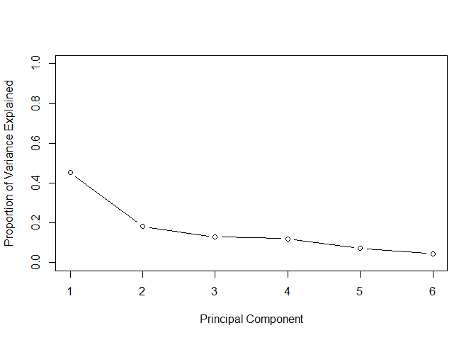
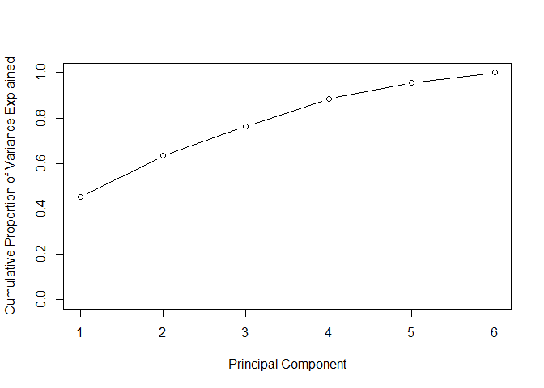
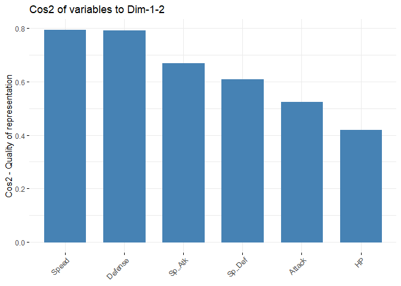

Principal Component Analysis
================

## Load data

First we’ll run k-means clustering on the `pokemon` dataset from
[Kaggle](https://www.kaggle.com/datasets/abcsds/pokemon?resource=download).

``` r
suppressPackageStartupMessages(library(dplyr))
set.seed(1000)

pokemon <- read.csv('pokemon.csv')

# subset features
df <- pokemon %>% select(HP, Attack, Defense, Sp..Atk, Sp..Def, Speed)
```

## Execute PCA

Then we’ll run a principle component analysis on the data

``` r
pr.out <- prcomp(df, center = TRUE, scale = TRUE)
summary(pr.out)
```

    ## Importance of components:
    ##                           PC1    PC2    PC3    PC4     PC5     PC6
    ## Standard deviation     1.6466 1.0457 0.8825 0.8489 0.65463 0.51681
    ## Proportion of Variance 0.4519 0.1822 0.1298 0.1201 0.07142 0.04451
    ## Cumulative Proportion  0.4519 0.6342 0.7640 0.8841 0.95549 1.00000

## Model

To examine the variance explained, we can extract the standard deviation
from the model and square it

``` r
pr.var <- pr.out$sdev^2
pve <- pr.var / sum(pr.var)
```

And build a scree plot for both proportion of variance explained and
cumulative proportion of variance explained

``` r
plot(pve, xlab = "Principal Component",
     ylab = "Proportion of Variance Explained",
     ylim = c(0, 1), type = "b")
```

<!-- -->

``` r
plot(cumsum(pve), xlab = "Principal Component",
     ylab = "Cumulative Proportion of Variance Explained",
     ylim = c(0, 1), type = "b")
```

<!-- -->

The plot shows that it takes 3 features to explain 75% or more of the
variance

## Contribution of each variable

To determine how much each variable is represented in a given component,
we can use the Cos2 plot (square cosine)

``` r
library(factoextra)
```

    ## Loading required package: ggplot2

    ## Welcome! Want to learn more? See two factoextra-related books at https://goo.gl/ve3WBa

``` r
fviz_cos2(pr.out, choice = "var", axes = 1:2)
```

<!-- -->

This computes the square cosine value for each variable with respect to
the first two principal components. The most represented variables are
speed and defense.
